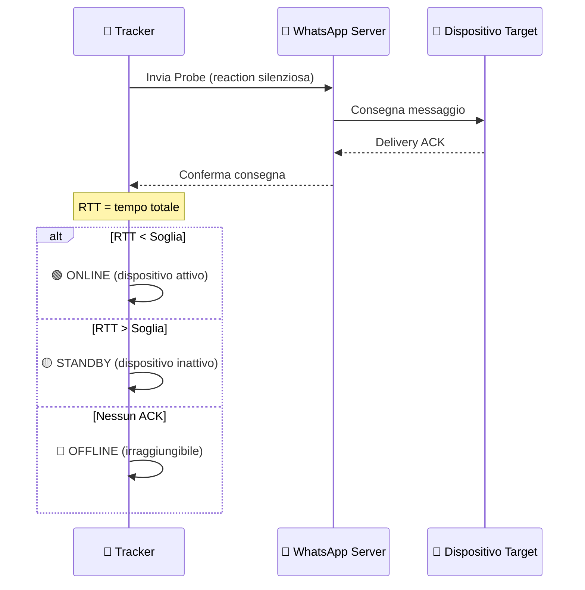
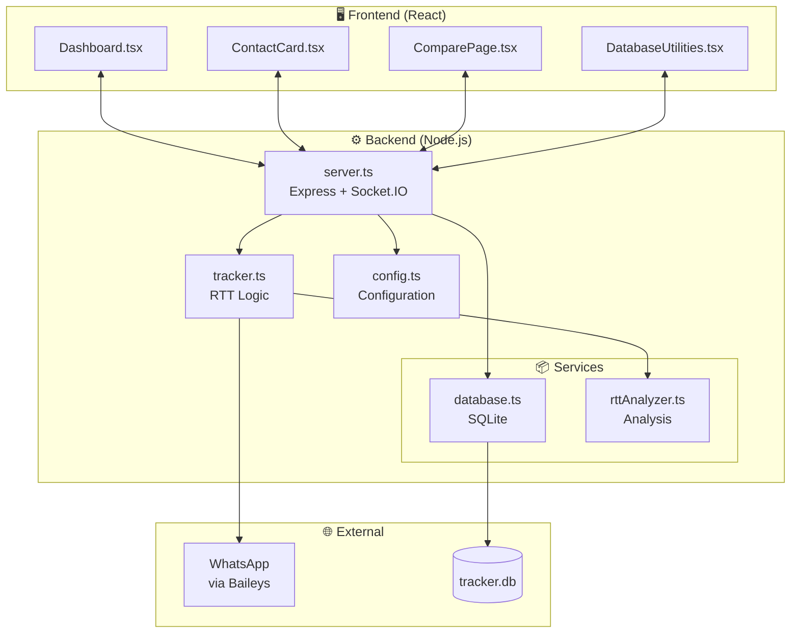
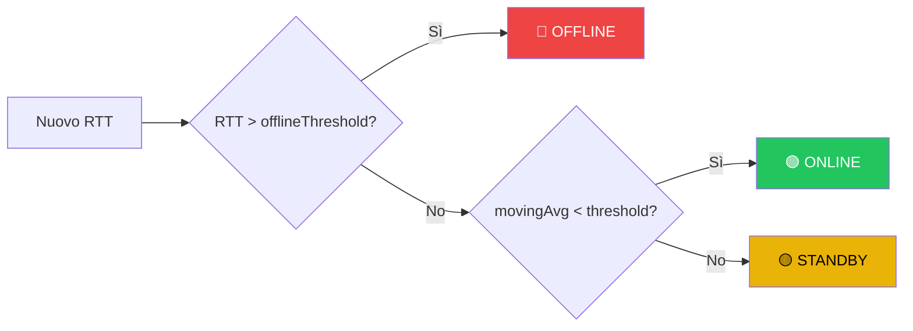

<h1 align="center">👻 Stealth WP Tracker</h1>
<p align="center"><strong>Monitoraggio Attività WhatsApp tramite Analisi RTT (Crediti https://github.com/gommzystudio/device-activity-tracker)</strong></p>

<p align="center">
  
  
  
</p>

<p align="center">
  
  
  
</p>

<br/>

> [!WARNING]
> **DISCLAIMER**: Strumento creato sulla base di https://github.com/gommzystudio/device-activity-tracker, le funzioni implementate possono in alcuni casi non essere stabili o complete, è stata modificata e migliorata anche la logica di tracciamento, la quale può comunque portare a falsi positivi. In questo file README.md non è specificata a pieno la logica di tracciamento, il sistema implementa un ulteriore sistema di calibrazione per migliorare i risultati, il quale parte automaticamente dopo la prima risposta a seguito di X stati Offline consecutivi.

---

<br/>

# 📋 PARTE 1: EXECUTIVE SUMMARY

<br/>

## 🎯 Cosa Fa

<table>
<tr>
<td width="60%">

Stealth WP Tracker rileva **quando un utente è attivo sul telefono** analizzando i tempi di risposta (RTT) dei messaggi WhatsApp.

</td>
<td width="40%">

| | |
|:---:|:---|
| 🔇 | **Silenzioso** - Nessuna notifica al target |
| 📱 | **Zero-install** - Non richiede accesso al dispositivo |
| 🔬 | **Scientifico** - Ricerca accademica peer-reviewed |
| 📊 | **Real-time** - Monitoraggio in tempo reale |

</td>
</tr>
</table>

<br/>

---

## ⚡ Capacità Operative

<table>
<tr>
<td align="center" width="14%">

<br/><sub>Target attivo</sub>
</td>
<td align="center" width="14%">

<br/><sub>Telefono inattivo</sub>
</td>
<td align="center" width="14%">

<br/><sub>Fuori rete</sub>
</td>
<td align="center" width="14%">

<br/><sub>Analisi pattern</sub>
</td>
<td align="center" width="14%">

<br/><sub>PDF & Excel</sub>
</td>
<td align="center" width="14%">

<br/><sub>Più target</sub>
</td>
<td align="center" width="14%">

<br/><sub>Confronto</sub>
</td>
</tr>
</table>

<br/>

---

## 🔍 Casi d'Uso

<details>
<summary><b>🕵️ Investigazioni</b></summary>

- **Verifica alibi**: Conferma se il soggetto era attivo in un determinato orario
- **Correlazione eventi**: Attività durante finestre temporali specifiche  
- **Pattern comportamentali**: Identificazione abitudini di utilizzo
- **Presenza/Assenza**: Verifica attività notturna o in orari insoliti

</details>

<details>
<summary><b>🏢 Sicurezza Aziendale</b></summary>

- Monitoraggio compliance orari di lavoro (con consenso)
- Verifica disponibilità personale reperibile

</details>

<details>
<summary><b>🎓 Ricerca Accademica</b></summary>

- Studio comportamenti digitali
- Analisi vulnerabilità privacy messaging

</details>

<br/>

---

## 🔄 Come Funziona



<br/>

---

## 🚀 Quick Start

```bash
# 1️⃣ Clona e installa
git clone [repository]
cd stealth-wp-tracker
npm install && cd client && npm install && cd ..

# 2️⃣ Avvia backend
npm run start:server

# 3️⃣ Avvia frontend (altro terminale)
npm run start:client
```

> [!TIP]
> Apri `http://localhost:3000` → Scansiona QR con WhatsApp → Inserisci numero → Monitora!

<br/>

---

## ⚠️ Limitazioni

> [!NOTE]
> - **Richiede WhatsApp**: Account WhatsApp per inviare probe
> - **No contenuti**: Non intercetta messaggi, solo metadati temporali
> - **Dipendenza rete**: Accuratezza influenzata da qualità connessione
> - **Rate limiting**: WhatsApp può limitare probe ad alta frequenza

<br/>

---

## ⚖️ Note Legali

> [!CAUTION]
> L'utilizzo di questo strumento potrebbe richiedere:
> - Consenso esplicito del soggetto monitorato
> - Autorizzazione giudiziaria
> - Conformità a GDPR e normative locali privacy
>
> **L'utente è responsabile dell'uso conforme alle leggi vigenti.**

<br/>
<br/>

---

# 🔧 PARTE 2: DOCUMENTAZIONE TECNICA

<br/>

## 📁 Architettura



<br/>

---

## 🛠️ Stack Tecnologico

<table>
<tr>
<th>Layer</th>
<th>Tecnologia</th>
<th>Versione</th>
</tr>
<tr><td>Runtime</td><td></td><td>20+</td></tr>
<tr><td>Language</td><td></td><td>5.0+</td></tr>
<tr><td>Backend</td><td></td><td>4.x</td></tr>
<tr><td>Realtime</td><td></td><td>4.x</td></tr>
<tr><td>WhatsApp</td><td></td><td>Latest</td></tr>
<tr><td>Database</td><td></td><td>better-sqlite3</td></tr>
<tr><td>Frontend</td><td></td><td>18+</td></tr>
<tr><td>Charts</td><td></td><td>2.x</td></tr>
<tr><td>Styling</td><td></td><td>3.x</td></tr>
</table>

<br/>

---

## ⚙️ Configurazione

> [!TIP]
> Accesso Admin Panel: **Doppio click sul logo** → Password admin

<details>
<summary><b>📋 Parametri Editabili</b></summary>

| Parametro | Default | Range | Descrizione |
|-----------|:-------:|:-----:|-------------|
| `probeIntervalDefault` | 2000ms | 50-60000 | Intervallo tra probe |
| `offlineThreshold` | 10000ms | 1000-30000 | RTT sopra = offline |
| `thresholdMultiplier` | 0.9 | 0.5-1.5 | Moltiplicatore soglia |
| `calibrationProbeCount` | 5 | 3-20 | Probe per calibrazione |
| `warmupEnabled` | false | bool | Scarta primi probe |
| `warmupProbeCount` | 2 | 1-5 | Probe da scartare |
| `outlierFilterEnabled` | false | bool | Filtra spike |

</details>

<details>
<summary><b>🔐 Variabili Ambiente</b></summary>

```bash
PORT=3001                    # Server port
CORS_ORIGIN=*               # CORS policy
REACT_APP_API_URL=http://localhost:3001
```

</details>

<br/>

---

## 🧮 Algoritmo di Detection



**Calcolo Soglia:**
```
threshold = median(globalRttHistory) × thresholdMultiplier
```

<br/>

---

<details>
<summary><h2>📡 Socket.IO Events Reference</h2></summary>

### Client → Server

| Event | Payload | Descrizione |
|-------|---------|-------------|
| `add-contact` | `string` | Avvia tracking |
| `stop-tracking` | `string` | Ferma tracking |
| `archive-contact` | `string` | Archivia sessione |
| `get-archived` | - | Richiedi archivio |
| `admin-get-config` | - | Richiedi configurazione |
| `admin-save-config` | `EditableConfig` | Salva configurazione |

### Server → Client

| Event | Payload | Descrizione |
|-------|---------|-------------|
| `tracker-update` | `{jid, devices, median, threshold, calibrationProgress}` | Update real-time |
| `connection-open` | - | WhatsApp connesso |
| `qr` | `string` | QR per login |
| `profile-pic` | `{jid, url}` | Foto profilo |

</details>

<details>
<summary><h2>🗄️ Database Schema</h2></summary>

### Tabella `sessions`

| Colonna | Tipo | Descrizione |
|---------|------|-------------|
| id | INTEGER PK | ID sessione |
| jid | TEXT UNIQUE | WhatsApp JID |
| phone_number | TEXT | Numero telefono |
| custom_name | TEXT | Nome personalizzato |
| is_active | INTEGER | 0/1 |
| is_archived | INTEGER | 0/1 |
| probe_method | TEXT | 'reaction' o 'delete' |

### Tabella `activity_logs`

| Colonna | Tipo | Descrizione |
|---------|------|-------------|
| id | INTEGER PK | ID log |
| session_id | INTEGER FK | Riferimento sessione |
| event_type | TEXT | rtt/online/offline/standby |
| rtt_value | REAL | RTT in ms |
| state | TEXT | Stato rilevato |
| timestamp | TEXT | ISO 8601 |

</details>

<br/>

---

## 🔧 Troubleshooting

| Problema | Soluzione |
|----------|-----------|
| QR non appare | Elimina cartella `auth_info_baileys/` e riavvia |
| Sempre OFFLINE | Verifica numero corretto, riavvia tracking |
| Database corrotto | Usa DatabaseUtilities per export/import |

<br/>

---

## 🛡️ Come Proteggersi

> [!IMPORTANT]
> Per proteggersi da questo tipo di monitoraggio:
> 1. **Settings → Privacy → Advanced → Block unknown senders**
> 2. Limita chi può vedere "last seen"
> 3. Usa VPN per mascherare pattern di connessione

<br/>

---

## 📚 Citazione

<details>
<summary><b>Paper accademico</b></summary>

```bibtex
@inproceedings{gegenhuber2024careless,
  title={Careless Whisper: Exploiting Silent Delivery Receipts 
         to Monitor Users on Mobile Instant Messengers},
  author={Gegenhuber, Gabriel K. and Günther, Maximilian and 
          Maier, Markus and Judmayer, Aljosha and Holzbauer, Florian 
          and Frenzel, Philipp É. and Ullrich, Johanna},
  year={2024},
  organization={University of Vienna, SBA Research}
}
```

</details>

<br/>

---

## 📄 License

MIT License - Vedi file [LICENSE](LICENSE)

<br/>

---

<p align="center">
  <strong>Built with</strong> 
  <a href="https://github.com/WhiskeySockets/Baileys">@whiskeysockets/baileys</a>
</p>

<p align="center">
  <sub>⚠️ Usare responsabilmente. Questo strumento dimostra vulnerabilità reali che riguardano milioni di utenti.</sub>
</p>
